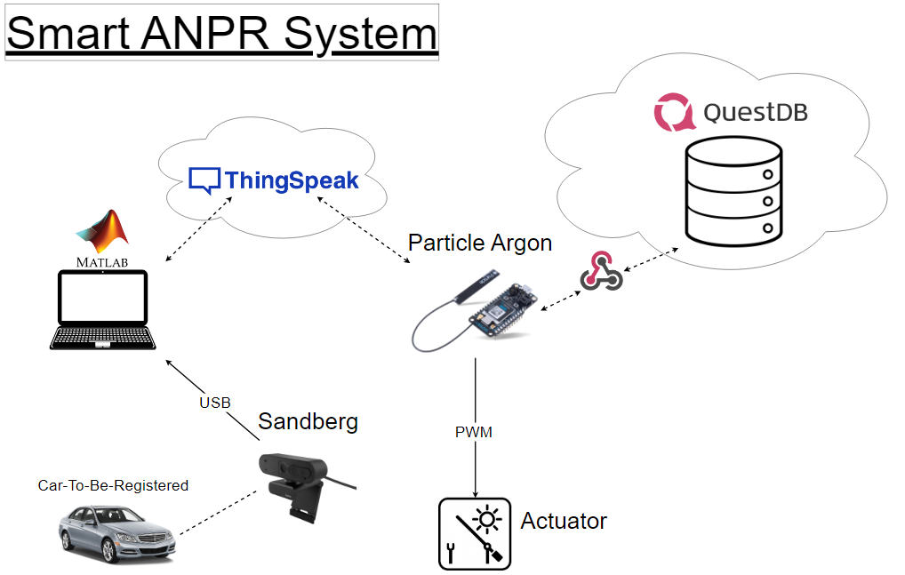
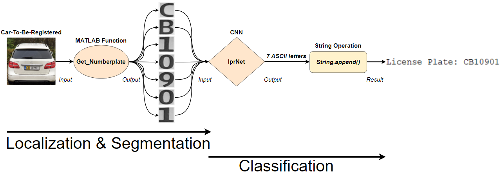
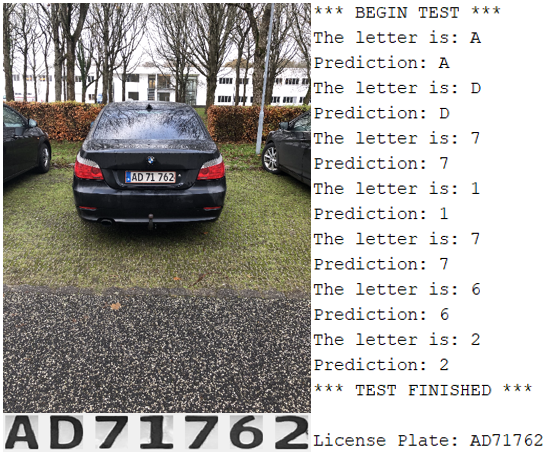
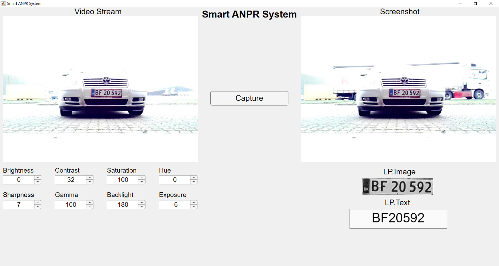

# Smart ANPR System
University Project For Internet of Things (IoT) &amp; Advanced Digital Signal Processing (ADSB)

Made by Rasmus Hyldgaard and Jørgen Moesgaard Jørgensen

[Demo Video](https://www.youtube.com/shorts/0ouIuk9_joQ)

## Table of Contents
* [Introduction](#introduction)
* [Project Requirements](#project-requirements)
* [Hardware](#hardware)
* [To-Do List](#to-do-list)
* [Results](#results)

## Introduction
The purpose of an ANPR (Automatic Number Plate Recognition) System is to capture an image of a car and use image processing techniques to separate
the license plate from the car itself, and then process each character individually with an algorithm. The system is thus capable of ensuring whether a car is allowed entry or not, based on their license plate. The idea behind our project is to design and implement a small embedded ANPR prototype system, using a Sandberg USB Webcam as sensor and a servo as actuator. The "Smart" part of our project is to introduce IoT by using a webservice in the cloud (QuestDB in this case) to access information and ThingSpeak to communicate wirelessly between PC and the embedded Argon processor. Registered license plates will be stored in QuestDB and the system will compare these to the ones being processed. The illustration below serves as a graphical overview of the project.

### MATLAB Detection & Classification

## Project Requirements
The project is divided into several requirements to be certain that it fulfills its systematic purposes and abides by the guidelines of the assignment at hand.
The requirements are separated into two categories: "Functional" and "Non-Functional" requirements. The "Functional" requirements are the "must have" requirements of the system, they describe what the system does. The "Non-Functional" requirements are the "desirable" requirements of the system, they describe how the system works. The list of requirements may be changed/expanded along with the development of the project.

### Functional Requirements
1. The system shall establish a connection between the camera and MATLAB.
2. The system shall wake up from a triggered event and capture an image.
3. The system shall process the image and read the license plate.
4. The system shall send and receive license plates through a ThingSpeak channel.
5. The system shall establish a webhook with a QuestDB database.
6. The system shall compare processed license plate with a registered license plate from database.
7. The system shall control an actuator when entry is permitted.

### Non-Functional Requirements
1. The system can compare with several registered license plates from the QuestDB database.
2. The system can add a log to QuestDB about which license plates were granted access or no access. 
3. The system may use machine learning to identify the country of origin for the captured license plate.
4. The system can be in a Low Power Mode when it's on standby.
5. The system may encrypt the data being sent and read through its communication channels.

## Hardware
The hardware used in this project is Particle Argon Wi-Fi Development Board, Sandberg USB Webcam PRO, 9g Micro Servo DF9GMS and a laptop running MATLAB.

## To-Do List
- Establish a connection between camera and MATLAB on Laptop. (**DONE**)
- Capture an image of a car with the camera and process it with Get_Numberplate function and lprNet. (**DONE**)
- Create a ThingSpeak Channel and write the detected license plate to ThingSpeak Channel from MATLAB. (**DONE**)
- Create a QuestDB database and store registered license plates. (**DONE**)
- Pull data from QuestDB database and read it on Particle Argon. (**DONE**)
- Read from ThingSpeak Channel with Particle Argon and print the string to console. (**DONE**)
- Make GUI Application in MATLAB to smoothen process. (**DONE**)
- Encrypt data between MATLAB and Argon, and data between Argon and QuestDB. (**DONE**)
- Put Argon in Low Power Mode when it's on standby. (**DONE**)
- Finish up software on Argon. (**DONE**)

## Results
This section contains some images of the results that our system managed to produce.

### License Plate Detection & Classification in MATLAB

### License Plate Real-Time Detection System
As part of the Smart ANPR System, we applied our detection & classification system in a GUI application, using the Sandberg Webcam to capture, detect and classify license plates in real-time.

